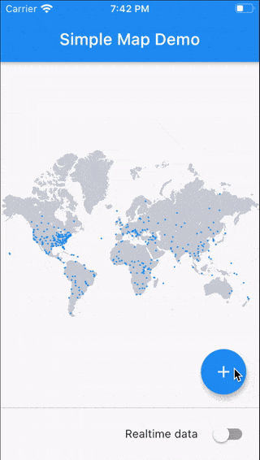
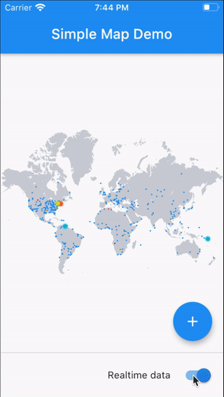

# Flutter Simple Map

Flutter plugin to display a world map with animated points in real time.
Can be used as a presentation of online users, devices, etc.




## Getting Started

* Add this to your pubspec.yaml
  ```
  dependencies:
  simple_map: ^0.1.0
  ```
* Get the package from Pub:
  ```
  flutter packages get
  ```
* Import it in your file
  ```
  import 'package:simple_map/simple_map.dart';
  ```

## Features

* Render simple customizable flat map
* Render points with animation effect
* Customize every point
* Create points
* Clear map

## Usage

* Using SimpleMapOptions
```dart
final mapOptions = SimpleMapOptions(
    // You can use your own map image
    mapAsset: 'assets/map.png',
    mapColor: Colors.grey,
    bgColor: Colors.black,
);
```

* Using SimpleMapController
```dart
final SimpleMapController mapController = SimpleMapController();

// Add single point.
mapController.addPoint(SimpleMapPoint());

// Add list of points
mapController.points = [SimpleMapPoint()];

// Clear the map.
mapController.clear();

SimpleMap(
  controller: mapController,
  options: mapOptions,
),
```

* Simple map with one center point with duration of 100 seconds
```dart
SimpleMap(
  controller: SimpleMapController(points: [
    SimpleMapPoint(
      lat: 0.0,
      lng: 0.0,
      color: Colors.blue,
      ttl: Duration(seconds: 100),
    )
  ]),
  options: mapOptions,
),
```

* Check out the complete example in github

